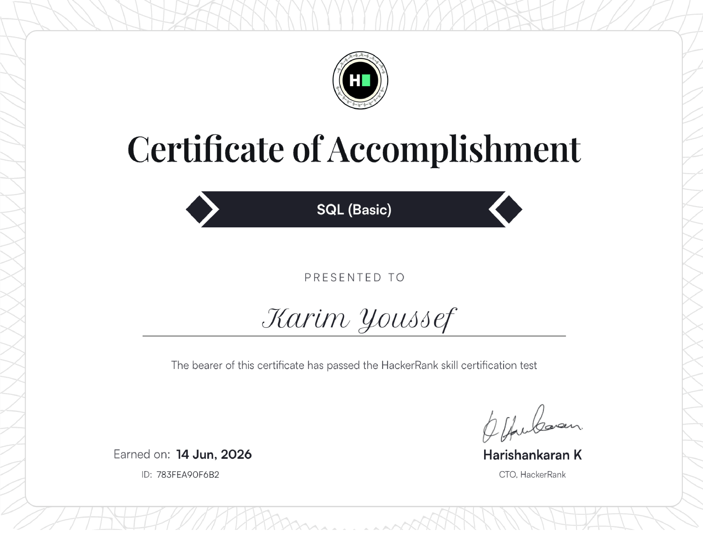

<div align="center">

# Karim Youssef


<br>


<br><br>


<a href="https://github.com/kkarimyyoussef">
  
</a>

<a href="https://linkedin.com/in/kkarimyoussef">
  
</a>

<a href="mailto:kkarimyyoussef@gmail.com">
  
</a>

<a href="https://github.com/kkarimyyoussef">
  
</a>

<br><br>


</div>

---

## About Me

I am a Computer Science student at Western University with a minor in Data Science and a growing focus on Data Analytics, Machine Learning, and software development.

I have experience working with Python, SQL, Java, JavaScript, C#, Pandas, NumPy, Tableau, Power BI, Git/GitHub, and database systems. My background includes software development, web development, teaching programming, and designing beginner-friendly technical learning experiences.

Outside of technology, I enjoy fitness and weight lifting, reading non-fiction, and building LEGOs.

### Open To


---

## Tech Stack

### Languages

<p align="left">
  
</p>

### Frontend

<p align="left">
  
</p>

### Backend & Databases

<p align="left">
  
  
  
  
</p>

### Cloud, DevOps & Tooling

<p align="left">
  
  
  
  
  
</p>

---

## Coding Profiles

<p align="center">
  <a href="https://leetcode.com/">
    
  </a>
  <a href="https://www.geeksforgeeks.org/">
    
  </a>
  <a href="https://www.hackerrank.com/">
    
  </a>
  <a href="https://www.codechef.com/">
    
  </a>
</p>

---

## Certifications

<div align="center">

<a href="certificates/sql-basic-certificate.pdf" target="_blank">
  
</a>

<br>

**SQL Basic Certificate**

<br><br>


</div>

### Data Analytics Certifications

- **SQL Basic Certificate**  
  Demonstrated foundational knowledge of SQL, including querying databases, filtering data, sorting results, using joins, and working with aggregate functions.

---

## GitHub Analytics

<div align="center">


</div>

---

## Contribution Activity

<div align="center">


</div>

---

## Current Focus

```yaml
Learning:
  - Machine Learning fundamentals
  - Data analytics workflows
  - System design foundations
  - Advanced SQL and database optimization

Building:
  - Analytics dashboards
  - Python data projects
  - Portfolio-ready software projects
  - Practical machine learning experiments

Exploring:
  - Product engineering
  - Full stack development
  - Business intelligence
  - AI-powered applications

Open To:
  - Data analytics internships
  - Software development internships
  - Machine learning projects
  - Technical collaboration
````

---

<div align="center">

**Building data-driven software with clarity, curiosity, and engineering discipline.**

</div>


```
